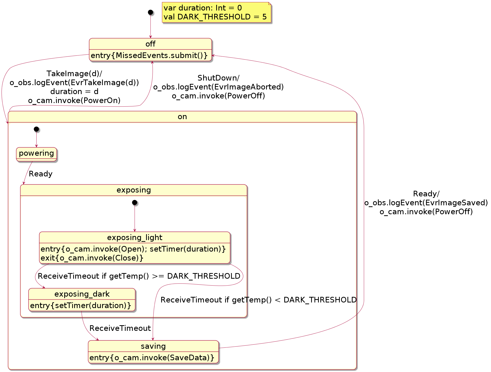

# Component Based Programming in Scala

The contents of this repository is a Scala DSL of a component-based framework for software development consiting to three components, all of which can be used together.

## Contents of Repository

### F' (F Prime) 

A small subset of the framework developed in C++ and described in the following paper, which has been the basis for the Scala implementation (see papers/fprime folder):

*  **F Prime: An Open-Source Framework for Small-Scale Flight Software Systems**,
   Robert L. Bocchino Jr., Timothy K. Canham, Garth J. Watney, Leonard J. Reder, 
   Jeffrey W. Levison,
   Jet Propulsion Laboratory, California Institute of Technology , 32nd Annual AIAA/USU
   Conference on Small Satellites.

F' supports programming a system as a collection of parallel executing components (tasks, threads). Each component's interface consists of a collection of typed input ports and a collection of typed output ports. Each output port of one component is connected to an input port of another component with a connection. Communication over ports can be asyncrhonous (buffered) as well as syncrhonous (as method calls).

### HSM (Hiearchical State Machines)

A Scala DSL for writing Hiearchical State Machines (HSMs). The DSL is described in the paper
(see papers/hsm folder):

* **Modeling and Monitoring of Hierarchical State Machines in Scala**, 
   Klaus Havelund and Rajeev Joshi, 
   9th International Workshop on Software Engineering for Resilient Systems (SERENE 2017),       
   September 4-5, 2017, Geneva, Switzerland, LNCS. 

An HSM supports programming with states, superstates, entry and exit actions of states,
and transitions between states. The concept corresponds to state charts.

### Daut (Data automata)

A Scala DSL for writing temporal event monitors. A version of the DSL is described in the paper (see papers/daut folder):

* **Data Automata in Scala**,
  Klaus Havelund, 
  TASE 2014,
  The 8th International Symposium on Theoretical Aspects of Software Engineering, 
  1-3 September 2014 - Changsha, China. IEEE Computer Society Press.

The DSL supports writing event monitors that have either a temporal logic appearance, or using state machines. The temporal logic appearance is what makes this DSL different from HSMs.

### Unification

The three DSLs mentioned above can be used together. For example, a system can be built as an F' application with interacting components, and where a component can contain a hierachical state machine or a data automaton monitor.

## Example

In the following is shown an example illustrating the concepts provided in this repository. It illustrates the use of F', HSM (Hierarchical State Machines), and Daut (Data automata monitors). The example can be found as package `example13_camera` in the test directory, which is a rendering of the example presented in the following paper,
which can be found in [papers/fprime/serene-2017.pdf](papers/hsm/serene-2017.pdf):

    "Modeling and Monitoring of Hierarchical State Machines in Scala",
    Klaus Havelund and Rajeev Joshi,
    9th International Workshop on Software Engineering for Resilient Systems (SERENE 2017),
    September 4-5, 2017, Geneva, Switzerland. Lecture Notes in Computer 
    Science Volume 10479.

The example is that of an imaging application on board a spacecraft, consisiting of two components (`Imaging` and `Camera`) and a `Ground` component. The `Imaging` component is given commands from ground to orchestrate the taking of an image with the shutter being open for a certain duration. The `Imaging` component communicates with the `Camera`. Furthermore, events, reporting what is happening, are sent to ground. The `Imaging` component is programmed as a hiearchical state machine and the ground, also a component, is programmed as a data automaton monitor. Each component has input ports (white) and output ports (blue). Output ports are connected to input ports.


We start by declaring the package and importing F', HSM, and Daut

```scala
import fprime._
import hsm._
import daut._
```

Then we declare the messages that are sent between components. First commands, which are
case classes/objects subclassing the pre-defined `Command` trait:

```scala
case class TakeImage(d: Int) extends Command
case object ShutDown extends Command
```

Then we define messages going between the `Imaging` and the `Camera` component:

```scala
trait Imaging2Camera
case object Open extends Imaging2Camera
case object Close extends Imaging2Camera
case object PowerOn extends Imaging2Camera
case object PowerOff extends Imaging2Camera
case object SaveData extends Imaging2Camera

trait Camera2Imaging
case object Ready extends Camera2Imaging
```

Finally we declare the kind of observation messages sent to ground to report what is happening on board the spacecraft.

```scala
case class EvrTakeImage(d: Int) extends Event
case object EvrOpen extends Event
case object EvrClose extends Event
case object EvrPowerOn extends Event
case object EvrPowerOff extends Event
case object EvrSaveData extends Event
case object EvrImageSaved extends Event
case object EvrImageAborted extends Event
```
The Imaging HSM is shown graphically below.



The HSM can receive a `TakeImage(d)` command from ground, where `d` denotes the exposure duration.  It responds to this request by sending a messade to the camera to power on, and waiting until the camera is ready.  It then aks the camera to open the shutter for the specified exposure duration (using a timer service which generates a timeout event after a specified period). Following this, it optionally takes a so-called dark exposure with the shutter closed (but only if the ambient temperature is above a specified threshold). A dark exposure allows determination of the noise from camera electronics, so that this can be subtracted from the acquired image.
Finally, it saves the image data, and powers off the camera.

Following standard HSM notation, the filled out black circles indicate the initial substate that is entered whenever a parent state is entered. Thus, for instance, a transition to the `on` state ends with the HSM in the `powering` state.  Associated with each state are also two optional code fragments, called the `entry` and `exit` actions.  The `entry` action is executed whenever the HSM transitions into a state, whereas the 
`exit` action is executed whenever the HSM transitions out of a state. Finally, the labeled 
arrows between states show the transitions that are caused in response to events received by the HSM.  A label has the form: 

    <event> if <condition> / <action>

which denotes that the transition is triggered when the HSM receives the specified `<event>` and the (optional) `<condition>` is true.  In response, the HSM transitions to the target state, and executes the specified (optional) `<action>`.  As an example, suppose the HSM is in state `exposing_light`, and it receives the event `ShutDown` (for which a transition is defined in the parent `on` state).  This would cause the HSM to perform the following actions (in order): 

1. the `exit` actions for the states `exposing_light`, `exposing` (no action), and `on` (no action).
2. the actions associated with the transition
3. the `entry` action for the state `off`.

Note that the `entry` action for the `off` state is `MissedEvents.submit()`. This is caused by the fact that the HSM may receive events when in a particular state that it is not prepared to process. These events are then stored for later re-submission as done here. This is a consequence of an F' component only having one input queue to which all input ports of the component connect.

The HSM in Scala is embedded in the Imaging component below. It is defined as a class subclassing the `Component` class, and defines two input ports, one for receiving commands from ground, and one for receving messages from the camera, and two outout ports, one for sending messages to the camera and one for sending observation events to ground.

```scala
class Imaging extends Component {
  val i_cmd = new CommandInput
  val i_cam = new Input[Camera2Imaging]
  val o_cam = new Output[Imaging2Camera]
  val o_obs = new ObsOutput

  /**
   * Data structure for handling incoming messages that the state machine is
   * not prepared to handle at arrival time. These are later re-submitted to
   * the state machine.
   */
   
  object MissedEvents {
    private var missedEvents : List[Any] = Nil

    def add(event : Any): Unit = {
      missedEvents ++=  List(event)
    }

    def submit(): Unit = {
      missedEvents match {
        case Nil =>
        case event :: rest =>
          missedEvents = rest
          selfTrigger(event)
      }
    }
  }

  /**
   * The hiearchical state machine.
   */

  object Machine extends HSM[Any] {
    var duration: Int = 0
    val DARK_THRESHOLD = 5

    def getTemp(): Int = 15

    states(off, on, powering, exposing, exposing_light, exposing_dark, saving)
    initial(off)

    object off extends state() {
      entry {
        MissedEvents.submit()
      }
      when {
        case TakeImage(d) => on exec {
          o_obs.logEvent(EvrTakeImage(d))
          duration = d
          o_cam.invoke(PowerOn)
        }
      }
    }

    object on extends state() {
      when {
        case ShutDown => off exec {
          o_obs.logEvent(EvrImageAborted)
          o_cam.invoke(PowerOff)
        }
      }
    }

    object powering extends state(on, true) {
      when {
        case Ready => exposing
      }
    }

    object exposing extends state(on)

    object exposing_light extends state(exposing, true) {
      entry {
        o_cam.invoke(Open)
        setTimer(duration)
      }
      exit {
        o_cam.invoke(Close)
      }
      when {
        case ReceiveTimeout => {
          if (getTemp() >= DARK_THRESHOLD) exposing_dark else saving
        }
      }
    }

    object exposing_dark extends state(exposing) {
      entry {
        setTimer(duration)
      }
      when {
        case ReceiveTimeout => saving
      }
    }

    object saving extends state(on) {
      entry {
        o_cam.invoke(SaveData)
      }
      when {
        case Ready => off exec {
          o_obs.logEvent(EvrImageSaved)
          o_cam.invoke(PowerOff)
        }
      }
    }

  }

  /**
   * The transition function for the component, immediatelty transferrinfg the
   * message to the state machine. If the state machine is not ready for the message,
   * the message is stored for later re-submission.
   */

  override def when: PartialFunction[Any, Unit] = {
    case input => if (!Machine(input)) MissedEvents.add(input)
  }
}
```

The `Camera` component just receives messages and sends messages, and does not perform any function. It acts as a stub.


```scala
class Camera extends Component {
  val i_img = new Input[Imaging2Camera]
  val o_img = new Output[Camera2Imaging]
  val o_obs = new ObsOutput

  def open(): Unit = {
    o_obs.invoke(EvrOpen)
  }

  def close(): Unit = {
    o_obs.invoke(EvrClose)
  }

  def powerOn(): Unit = {
    o_obs.invoke(EvrPowerOn)
  }

  def powerOff(): Unit = {
    o_obs.invoke(EvrPowerOff)
  }

  def saveData(): Unit = {
    o_obs.invoke(EvrSaveData)
  }

  override def when: PartialFunction[Any, Unit] = {
    case Open => open()
    case Close => close()
    case PowerOn => powerOn(); o_img.invoke(Ready)
    case PowerOff => powerOff()
    case SaveData => saveData(); o_img.invoke(Ready)
  }
}
```

The `Ground` component contains a data automaton monitor, formulated as a temporal logic property.


```scala
class Ground extends Component {
  val i_int = new Input[Int] // inputs from the main program
  val i_obs = new ObsInput
  val o_cmd = new CommandOutput

  /**
   * The property states that when an `EvrTakeImage` command is observed, then
   * it is an error to observe another `EvrTakeImage` before
   * either an `EvrImageSaved` or `EvrImageAborted` is observed. This reflects
   * the property that taking an image should end with the image being saved or aborted
   * before another image is processed.
   */

  object SaveOrAbort extends Monitor[Observation] {
    always {
      case EvrTakeImage(_) => hot {
        case EvrImageSaved | EvrImageAborted => ok
        case EvrTakeImage(_) => error("Image was not saved or aborted")
      }
    }
  }

  override def when: PartialFunction[Any, Unit] = {
    case d: Int => o_cmd.invoke(TakeImage(d))
    case o: Observation => SaveOrAbort.verify(o)
  }
}
```

The main program declares the components, connects them, and then asks the ground to take three images with exposure durations of respectively 1000, 2000, and 3000 milliseconds. 

```scala
object Main {
  def main(args: Array[String]): Unit = {
    // Create component instances:
    val imaging = new Imaging
    val camera = new Camera
    val ground = new Ground

    // Connect components:
    imaging.o_cam.connect(camera.i_img)
    imaging.o_obs.connect(ground.i_obs)
    camera.o_img.connect(imaging.i_cam)
    camera.o_obs.connect(ground.i_obs)
    ground.o_cmd.connect(imaging.i_cmd)

    // Take three pictures:
    ground.i_int.invoke(1000)
    ground.i_int.invoke(2000)
    ground.i_int.invoke(3000)
  }
}
```